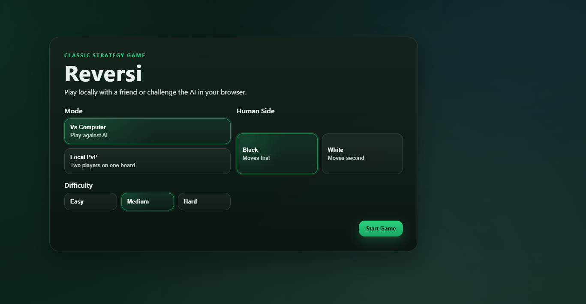
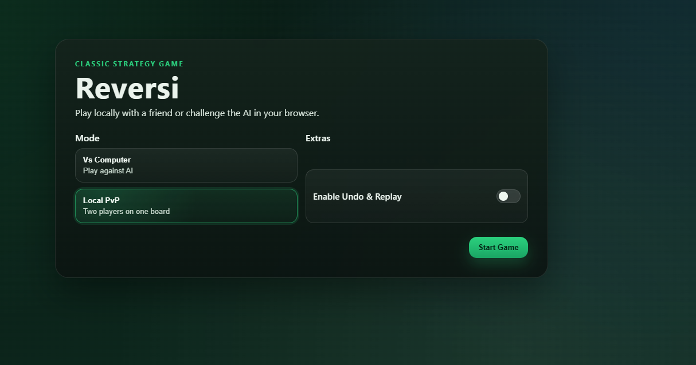
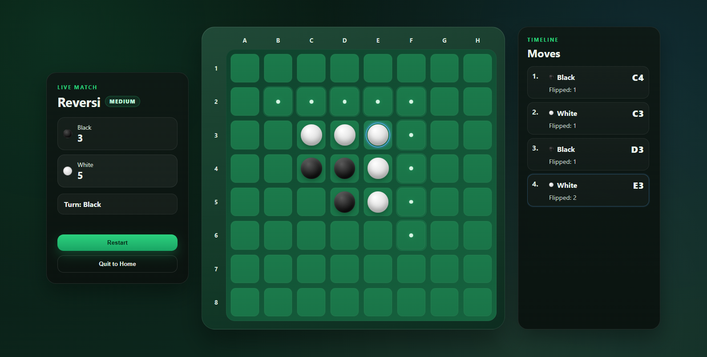
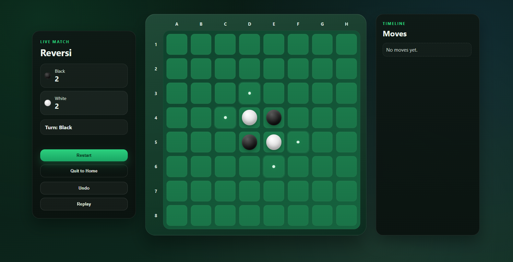
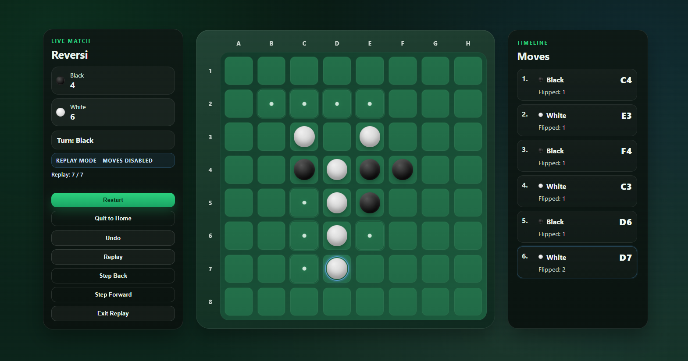

# Reversi (Othello) Web App

A full-stack implementation of the classic **Reversi / Othello** strategy game, built with:

- Python (Flask) backend  
- Vanilla HTML / CSS / JavaScript frontend  
- Modular game engine architecture  
- Multiple AI strategies (Random → Minimax)

The backend manages all rules, game state transitions, AI logic, and replay snapshots.  
The frontend focuses on rendering, interaction, and visual feedback.

---

## Why This Project

I built this project to combine algorithmic thinking, clean architecture design, and user-facing interface work into a single cohesive application.

Reversi is simple to understand but non-trivial to implement correctly. It requires:

- Precise rule validation
- Correct directional scanning logic
- State consistency
- AI decision modeling
- Clean separation between engine and UI

This made it a strong candidate for building a structured, production-style mini system rather than just a script.

---

## Game Overview

Reversi is played on an 8×8 board. Players alternate placing discs in a way that brackets opponent discs horizontally, vertically, or diagonally. All bracketed discs are flipped.

The game ends when neither player has a legal move. The player with the most discs wins.

This implementation includes:

- Local Player vs Player
- Player vs AI (three difficulty levels)
- Move timeline panel
- Replay mode based on backend snapshots
- Undo support (PvP only)
- WSGI-ready structure for production-style runs

---

## Screenshots

### Main Menu – Vs Computer



- Select mode
- Choose player color
- Choose AI difficulty
- Structured setup flow before game start

---

### Main Menu – Local PvP with Replay Option



- Two-player local mode
- Optional Undo & Replay toggle
- Replay intentionally restricted to PvP

---

### Live Game – Vs Computer



- Real-time score tracking
- Turn indicator
- Legal move highlighting
- Move timeline with:
  - Move number
  - Player color
  - Board coordinate (e.g., C4)
  - Flipped-disc count

---

### Live Game – Local PvP



- Accurate flipping logic
- Automatic pass handling
- Game-over detection
- Clean, centered board layout

---

### Replay Mode



Replay mode is powered by server-side board snapshots.

Features:
- Step backward / forward
- Timeline-based navigation
- Replay state indicator
- Read-only board during replay
- Snapshot-based state consistency

---

## Core Features

### Gameplay Engine
- Classic 8×8 Reversi rules
- Legal move validation
- Directional scanning logic
- Disc flipping correctness
- Automatic pass detection
- End-game detection
- Final score computation

### Game Modes
- Local PvP
- Player vs AI

### AI Difficulties
- Easy — random legal move
- Medium — greedy corner-weighted heuristic
- Hard — Minimax (depth 5)

### Timeline & Move Tracking
Each move stores:
- Move index
- Player color
- Algebraic coordinate (e.g., E3)
- Exact flipped-disc count

### Undo & Replay (PvP Only)
- Undo last move
- Enter replay mode
- Step backward / forward
- Moves disabled during replay
- Backend-managed snapshots

### UI & UX
- Structured home screen
- Clear board state visuals
- Highlighted legal moves
- Last-move emphasis
- Disc flip animations
- Responsive layout

---

## Architecture

```text
Browser UI (HTML / CSS / JS)
        |
        v
Flask API Routes (backend/api)
        |
        v
GameState (backend/engine/game_state.py)
        |
        +--> Board Logic & Flipping (engine/board.py)
        +--> AI Strategies (engine/strategies/)
